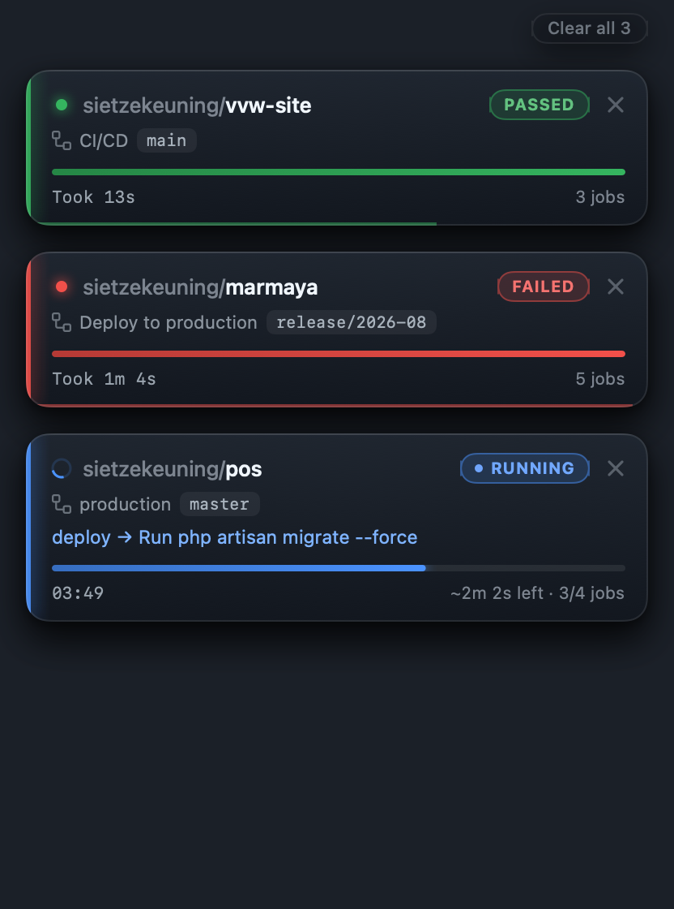

<p align="center">
  
</p>

<h1 align="center">KingProgress</h1>

<p align="center">
  A small native macOS menu bar app that watches your GitHub Actions and slides a card onto your
  screen the moment a workflow starts — with a progress bar based on how long that workflow usually takes.
</p>

<p align="center">
  
</p>

The cards live in the top-right corner, on top of whatever you are doing. They are click-through, so
they never get in the way of the window underneath — until you move your cursor over one.

| | |
| --- | --- |
| **Live status** | The pill in the corner tracks the run: `QUEUED` → `RUNNING` → `PASSED` or `FAILED`, with the accent colour, dot and progress bar following along. |
| **Time-based progress** | The bar is measured against the median wall-clock time of the last 3 successful runs of that same workflow, so it shows `~2m 1s left` instead of a guess. No history yet? It falls back to completed jobs, or an indeterminate sweep. |
| **Current step** | The job and step that GitHub is running right now, e.g. `deploy → Run php artisan migrate --force`. |
| **Sticks around** | A finished run stays for 20 seconds — green for passed, red for failed — with a thin bar draining along the bottom edge, then slides away on its own. |
| **Click to open** | Clicking a card opens that run on GitHub in your browser. |
| **Dismissable** | The `×` gets rid of a card immediately, and `Clear all` clears the stack. A dismissed run stays gone; the next run shows up as normal. |
| **Yours only, if you like** | Filter runs by who triggered them, and pick exactly which repositories to watch. |
| **Updates itself** | Sparkle checks for a new version every six hours, downloads it in the background and installs it the next time KingProgress restarts. |
| **Light on the Mac** | Swift, AppKit and SwiftUI — no browser engine. One process that idles at zero CPU. |

KingProgress used to be an Electron app; version 1.5.0 is the rewrite. Everything works and looks the
same, it just no longer costs a browser's worth of memory and CPU to show three cards.

## Install

1. Download the newest `KingProgress-x.y.z.dmg` from the [releases](../../releases).
2. Open the DMG and drag **KingProgress** into **Applications**. It is signed with a Developer ID and
   notarised by Apple, so it opens with a plain double-click — no right-click trick, no
   `xattr` incantation.
3. KingProgress has no dock icon — look for the crown in the menu bar at the top of the screen.

Requires macOS 14 Sonoma or later. Universal binary (Apple silicon and Intel).

That is the last time you have to do this by hand — from here on KingProgress keeps itself up to date.
The one exception is the old Electron version (1.4.0 and earlier): it cannot install this one, so
replace it by hand once. Its token does not carry over; sign in again.

## Connecting to GitHub

The first launch opens a window with a **Create a token on GitHub** button. It opens GitHub with the
`repo` and `workflow` scopes already ticked — pick an expiry, click **Generate token**, and copy it.
KingProgress notices the token on your clipboard and signs you in; there is nothing to paste unless you
want to.

The token is stored in your login keychain and is only ever sent to `api.github.com`. To remove it:
menu bar icon → gear → **Sign out**, or right-click the menu bar icon → **Disconnect**.

<details>
<summary>Sign in with GitHub instead of a token</summary>

KingProgress also supports the OAuth device flow — the `gh auth login` experience, where the app shows a
code and you approve it in the browser. It needs an OAuth App client id, and deliberately no client
secret (this repository is public, so a secret could never ship in it).

1. Create an OAuth App at <https://github.com/settings/developers>.
2. Tick **Enable Device Flow**.
3. Put its client id in `builtInClientId` in `KingProgress/Model/AppSettings.swift`, or set it at
   runtime with `defaults write com.kingprogress.app githubClientId <id>`.

The **Sign in with GitHub** button then replaces the token flow.
</details>

## Staying up to date

KingProgress asks GitHub whether there is a newer release a few times a day, downloads it quietly in the
background, and installs it the next time it starts — so most of the time a new version just arrives.

Nothing is swapped out from under you mid-session. When a download is ready, the menu bar menu gets a
**Restart to update to …** item; take it, or ignore it and quit as normal, and the new version is
there next time. Settings shows the same thing, along with a **Check now** button.

## Settings

<p align="center">
  
</p>

- **Triggered by** — watch every run, only the ones you trigger yourself, or only those from specific
  people. Handy on a shared repository where you do not want a card for every colleague's push.
- **Repositories** — tick exactly which repositories to watch. Leave everything unticked and
  KingProgress follows your 5 most recently updated repositories automatically.
- **Startup** — KingProgress starts when you log in, unless you turn that off.

Watching a lot of repositories is cheap: KingProgress uses conditional requests, and GitHub does not
charge rate limit for a `304 Not Modified`, so a repository where nothing happened costs nothing.
Polling backs off to 15 seconds when idle and speeds up to 8 while a run is in flight, which stays
far inside GitHub's 5,000 requests per hour.

## Using it

- **Menu bar icon** — click it to open the window with everything that is currently running, plus the
  gear for settings. While that window is open the cards stay away: the window already lists the same
  runs, and the same thing twice on screen is just noise. Close it and they come straight back.
  Right-click the icon for the menu: show the window, restart into a downloaded update, disconnect, quit.

  

- **Cards** appear on their own whenever a run starts. Hover one to interact with it, click it to
  open that run on GitHub, hit `×` to dismiss it, or `Clear all` to clear the stack.

  

## Build it yourself

Requires Xcode 15 or later and [xcodegen](https://github.com/yonaskolb/XcodeGen).

```bash
git clone git@github.com:sietzekeuning/kingprogress.git
cd kingprogress
brew install xcodegen
xcodegen generate
open KingProgress.xcodeproj
```

Or from the terminal:

```bash
xcodebuild -project KingProgress.xcodeproj -scheme KingProgress -configuration Debug \
    -derivedDataPath build -destination 'platform=macOS' build
```

The app lands in `build/Build/Products/Debug/KingProgress.app`. The project signs with a Developer ID
certificate; pass `CODE_SIGN_IDENTITY="Apple Development"` or `CODE_SIGN_IDENTITY=-` if you do not have one.

### Development

```bash
APP=build/Build/Products/Debug/KingProgress.app/Contents/MacOS/KingProgress
KINGPROGRESS_DEMO=1 $APP        # fake runs, to work on the cards without waiting for CI
KINGPROGRESS_VERBOSE=1 $APP     # log every poll: repos swept, how many were unchanged, runs tracked
KINGPROGRESS_DEBUG=1 $APP       # log the status item, window and card panel geometry every few seconds
KINGPROGRESS_SNAPSHOT=/tmp/window.png KINGPROGRESS_SNAPSHOT_KIND=window $APP
```

`KINGPROGRESS_DEMO=1` seeds a few fake workflow runs that move through queued → running → passed and
failed, so the cards, the animations and the auto-dismiss can all be checked in about 20 seconds.

`KINGPROGRESS_SNAPSHOT` renders a screen to a PNG and quits, without needing screen recording
permission — that is how the screenshots in this README are made. `KINGPROGRESS_SNAPSHOT_KIND` picks
`window` (default), `settings`, `login` or `popup`.

- App delegate: `KingProgress/KingProgressApp.swift` — the status item, the window, the card panel
- Polling and run state: `KingProgress/Model/RunMonitor.swift`
- GitHub: `KingProgress/Services/GitHubClient.swift` and `GitHubAuth.swift` — REST calls, device flow, token validation
- Updates: `KingProgress/Services/UpdateController.swift` — Sparkle, plus the "restart to update" state
- Views: `KingProgress/Views/` — `PopupView.swift` (the stack), `ActionCard.swift` (a card), `MainView.swift`, `SettingsView.swift`, `LoginView.swift`
- Windows: `KingProgress/Windows/` — the main window and the transparent, click-through card panel

## Releasing

```bash
export APPLE_API_KEY=~/.appstoreconnect/private_keys/AuthKey_XXXXXXXXXX.p8
export APPLE_API_KEY_ID=XXXXXXXXXX
export APPLE_API_ISSUER=xxxxxxxx-xxxx-xxxx-xxxx-xxxxxxxxxxxx
export SPARKLE_BIN=~/.sparkle/bin        # bin/ of the Sparkle release download

scripts/release.sh 1.5.0                 # draft release on GitHub
scripts/release.sh 1.5.0 --live          # published straight away
```

The script bumps the version in `project.yml`, builds a universal Release build, signs the app and
Sparkle's helpers with the Developer ID certificate, notarises and staples the app, wraps it in a disk
image (notarised and stapled as well), signs the update zip with the EdDSA key in the keychain
(account `kingprogress`, made with Sparkle's `generate_keys`), adds the release to `appcast.xml`,
commits, tags `vX.Y.Z` and creates the GitHub release with the `.dmg` and the `.zip` attached.

Installed copies read `appcast.xml` straight off the `master` branch, so a release only reaches them
once that commit is pushed, which the script does. A draft release is invisible to nobody — the appcast
already points at its files — so publish it on GitHub as soon as the artifacts look right.

Notarisation needs a paid Apple Developer Program membership and a *Developer ID Application*
certificate (an "Apple Development" one is not enough for downloads outside the App Store). For the
credentials, either an App Store Connect API key with the Developer role, or an app-specific password
stored with `xcrun notarytool store-credentials kingprogress …` and `APPLE_KEYCHAIN_PROFILE=kingprogress`.

## License

MIT
