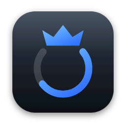
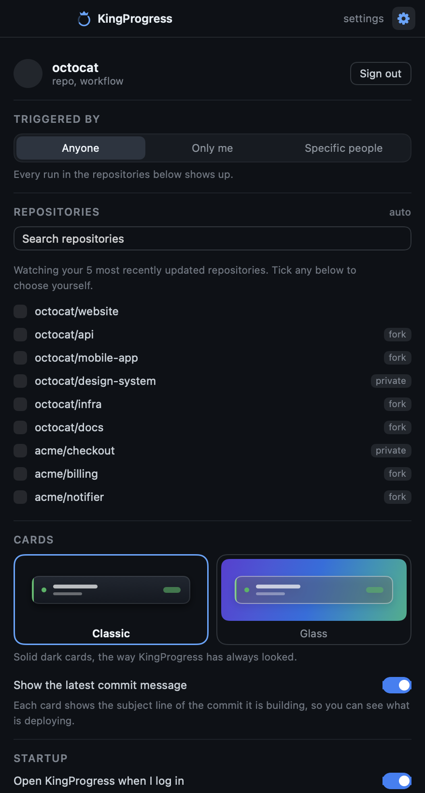
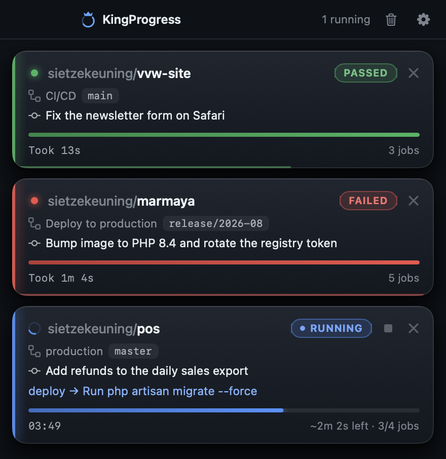

<p align="center">
  
</p>

<h1 align="center">KingProgress</h1>

<p align="center">
  A small desktop app that watches your GitHub Actions and slides a card onto your screen the moment
  a workflow starts — with a progress bar based on how long that workflow usually takes.
</p>

<p align="center">
  
</p>

The cards live in the top-right corner, on top of whatever you are doing. They are click-through, so
they never get in the way of the window underneath — until you move your cursor over one.

| | |
| --- | --- |
| **Live status** | The pill in the corner tracks the run: `QUEUED` → `RUNNING` → `PASSED` or `FAILED`, with the accent colour, dot and progress bar following along. |
| **Time-based progress** | The bar is measured against the median wall-clock time of the last 3 successful runs of that same workflow, so it shows `~2m 1s left` instead of a guess. No history yet? It falls back to completed jobs, or an indeterminate sweep. |
| **Current step** | The job and step that GitHub is running right now, e.g. `deploy → Run php artisan migrate --force`. |
| **Sticks around** | A finished run stays for 20 seconds — green for passed, red for failed — with a thin bar draining along the bottom edge, then slides away on its own. |
| **Click to open** | Clicking a card opens that run on GitHub in your browser. |
| **Dismissable** | The `×` gets rid of a card immediately, and `Clear all` clears the stack. A dismissed run stays gone; the next run shows up as normal. |
| **Yours only, if you like** | Filter runs by who triggered them, and pick exactly which repositories to watch. |
| **Updates itself** | KingProgress checks GitHub for a new version every few hours, downloads it in the background and swaps it in the next time it restarts. No downloading a DMG again. |

## Install

### macOS

1. Download `KingProgress-1.4.0-arm64.dmg` from the [releases](../../releases) (or build it yourself, see below).
2. Open the DMG and drag **KingProgress** into **Applications**. It is signed with a Developer ID and
   notarised by Apple, so it opens with a plain double-click — no right-click trick, no
   `xattr` incantation.
3. KingProgress has no dock icon — look for the menu bar icon at the top of the screen.

That is the last time you have to do this by hand — from here on KingProgress keeps itself up to date.

### Windows

1. Download and run `KingProgress Setup 1.4.0.exe`, or use the portable `.exe` if you would rather not
   install anything.
2. KingProgress adds itself to the startup items and lives in the system tray.

### Linux

```bash
chmod +x KingProgress-1.4.0.AppImage && ./KingProgress-1.4.0.AppImage
# or, on Debian/Ubuntu:
sudo dpkg -i kingprogress_1.4.0_amd64.deb
```

## Connecting to GitHub

The first launch opens a window with a **Create a token on GitHub** button. It opens GitHub with the
`repo` and `workflow` scopes already ticked — pick an expiry, click **Generate token**, and copy it.
KingProgress notices the token on your clipboard and signs you in; there is nothing to paste unless you
want to.

The token is stored in your OS keychain (via Electron's `safeStorage`) and is only ever sent to
`api.github.com`. To remove it: menu bar icon → open the window → gear → **Sign out**.

<details>
<summary>Sign in with GitHub instead of a token</summary>

KingProgress also supports the OAuth device flow — the `gh auth login` experience, where the app shows a
code and you approve it in the browser. It needs an OAuth App client id, and deliberately no client
secret (this repository is public, so a secret could never ship in it).

1. Create an OAuth App at <https://github.com/settings/developers>.
2. Tick **Enable Device Flow**.
3. Put its client id in `BUILT_IN_CLIENT_ID` in `src/main/main.ts`, or set it at runtime with
   `githubClientId` in the config store.

The **Sign in with GitHub** button then replaces the token flow.
</details>

## Staying up to date

KingProgress asks GitHub whether there is a newer release a few times a day, downloads it quietly in the
background, and installs it the next time it starts — so most of the time a new version just arrives.

Nothing is swapped out from under you mid-session. When a download is ready, the menu bar menu gets a
**Restart to update to …** item; take it, or ignore it and quit as normal, and the new version is
there next time. Settings shows the same thing, along with a **Check now** button.

The `.deb` and the Windows portable `.exe` are the exceptions: those belong to your package manager
and to wherever you put the file, so KingProgress leaves them alone and says so in Settings.

## Settings

<p align="center">
  
</p>

- **Triggered by** — watch every run, only the ones you trigger yourself, or only those from specific
  people. Handy on a shared repository where you do not want a card for every colleague's push.
- **Repositories** — tick exactly which repositories to watch. Leave everything unticked and
  KingProgress follows your 5 most recently updated repositories automatically.

Watching a lot of repositories is cheap: KingProgress uses conditional requests, and GitHub does not
charge rate limit for a `304 Not Modified`, so a repository where nothing happened costs nothing.
Polling backs off to 15 seconds when idle and speeds up to 8 while a run is in flight, which stays
far inside GitHub's 5,000 requests per hour.

## Using it

- **Menu bar icon** — click it to open the window with everything that is currently running, plus the
  gear for settings. While that window is open the cards stay away: the window already lists the same
  runs, and the same thing twice on screen is just noise. Close it and they come straight back.

  

- **Cards** appear on their own whenever a run starts. Hover one to interact with it, click it to
  open that run on GitHub, hit `×` to dismiss it, or `Clear all` to clear the stack.

## Build it yourself

Requires Node 18+ and npm.

```bash
git clone git@github.com:sietzekeuning/kingprogress.git
cd kingprogress
npm install
npm run package:mac     # or package:win / package:linux
```

The installers end up in `release/`. See [BUILD.md](BUILD.md) for the full matrix, code signing and
notarisation.

### Development

```bash
npm run dev                     # vite + electron with hot reload
KINGPROGRESS_DEMO=1 npm start      # fake runs, to work on the cards without waiting for CI
KINGPROGRESS_VERBOSE=1 npm start   # log every poll
```

- Main process: `src/main/main.ts` — polling, run state, the popup window
- Updates: `src/main/updater.ts` — checking GitHub releases, downloading, staging the install
- Authentication: `src/main/auth.ts` — device flow and token validation
- Renderer: `src/renderer/` — `views/PopupView.vue` (the stack), `components/ActionCard.vue` (a card)
- Preload bridge: `src/main/preload.ts`

## License

MIT
